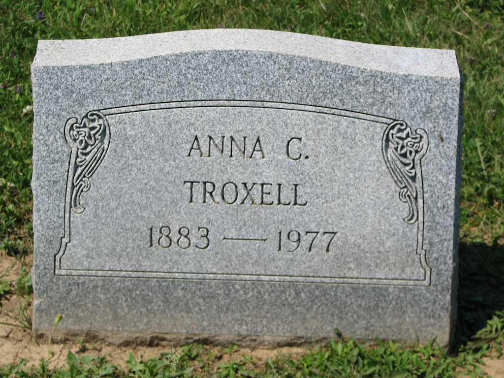

!SLIDE title-slide

# Let's make Ruby better! #

(What Rubyists should steal from Haskell and Clojure)

!SLIDE ralph

!SLIDE

# I'm scared right now.

!SLIDE

# I have a dirty secret.

!SLIDE

# I'm going to make it up to you.

!SLIDE

# Comprehensions

!SLIDE code center medcode

# How Ruby eats lunch:

    @@@ ruby
    foods.each { |food| eat(food) }

!SLIDE code center bigcode

## Sadly, we cannot eat thusly:

    @@@ ruby
    foods.each(&:eat)

!SLIDE code center medcode

## Coffeescript eats our lunch:

    @@@ coffeescript
    eat food for food in foods

!SLIDE code medsmallcode 

## Ruby gets health conscious:

    @@@ ruby
    foods.each do |food|
      eat(food) if food != 'chocolate'
    end

!SLIDE code smallcode

## Coffeescript is lean and mean:

    @@@ coffeescript
    eat food for food in foods when food inst 'chocolate'

!SLIDE grammie

!SLIDE chadtweet

!SLIDE 
# I believe that whitespace is our future
## (or, maybe, sexps)

!SLIDE code
    @@@ ruby
    # Standard ruby.
    if tired?
      take_nap

      if still_tired?
        drink_coffee
        commence_self_hatred
      end
    end

    work_on_stuff do |work|
      procrastinate
      procrastinate
      procrastinate
      work(work)
    end

!SLIDE code
    @@@ ruby
    # Betcha can still read this.
    if tired?
      take_nap

      if still_tired?
        drink_coffee
        commence_self_hatred

    work_on_stuff |work|
      procrastinate
      procrastinate
      procrastinate
      work(work)

!SLIDE code

# Englishisms

    @@@ coffeescript
    # is
    launchMissles() if launchCode is '1234'

    # isnt
    falsifyData() if result isnt 'expected'

    # in
    leaveEarly() unless client in office
